# 民航维修大模型持续预训练
## 背景
我们针对民航维修领域，构建了针对 Embedding 和 LLM 的评估基准 (Benchmark) 。在此评估基准的指导下，我们构建并逐步优化民航维修领域的应用大模型。此开源仓库是民航维修大模型的预训练工作。从 openAI 的 chatgpt 开启大模型时代以来，建设大模型往往经历“预训练(PT)、监督微调(SFT)、基于人类偏好的强化(RLHF)”三个阶段。预训练阶段主要摄取知识，是后续两个阶段的基础。在我们的 CAMB 评估基准上可以看到，目前不管是开源还是闭源模型，不管是嵌入模型还是大语言模型，都缺乏民航维修领域的专业知识。因此，持续预训练是很有必要的。

## 预训练数据收集标准
与 CAMB 评估基准的构建标准类似，我们从培养合格的民航维修工程师的教学大纲出发，来构建我们民航维修大模型预训练的数据和训练标准。民航维修专业在高等教育或者职业教育中都有设立，并发展较为成熟，也有较为权威细致的民航维修专业的教学培养大纲。我们按照教学大纲以及结合网上相关开源社区论坛和图书论文期刊等，对民航维修领域的数据进行收集。教学培养大纲如图所示：
<details>
<summary>教学培养大纲</summary>
<p align="center"> 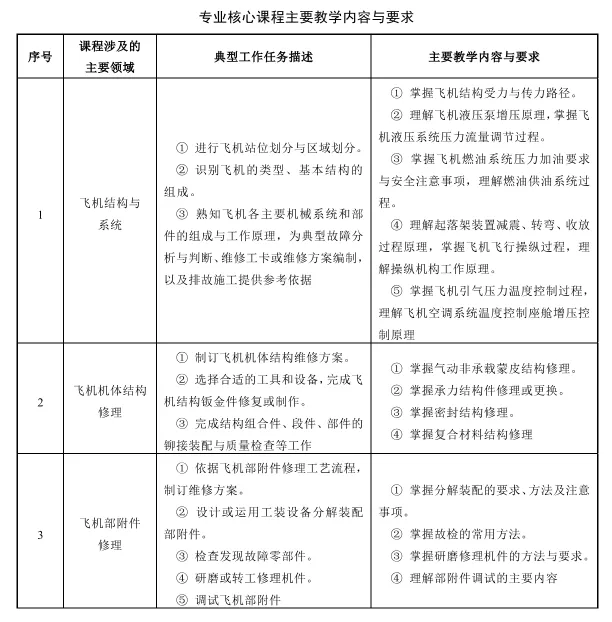       </p>
<p align="center"> 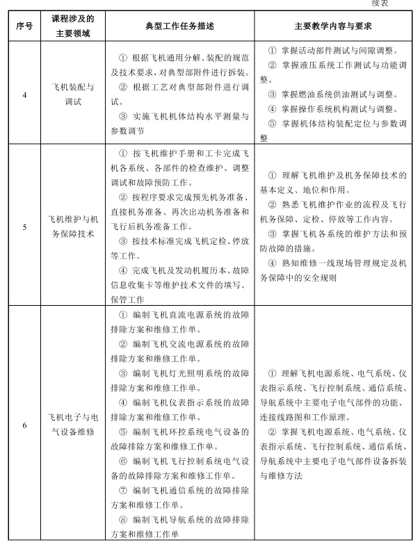       </p>
<p align="center"> 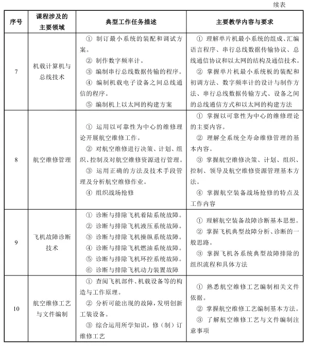       </p>
</details>

## 预训练数据收集
民航维修预训练数据源体系
<p align="center"> 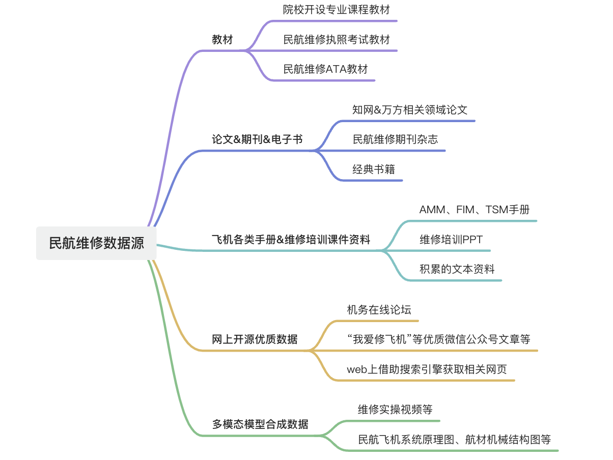       </p>

### 民航维修开设课程教材
1. 根据大纲，获取开设民航维修专业的相关院校教材，示例如下图：

    <details>
    <summary>开设课程</summary>
    <p align="center"> 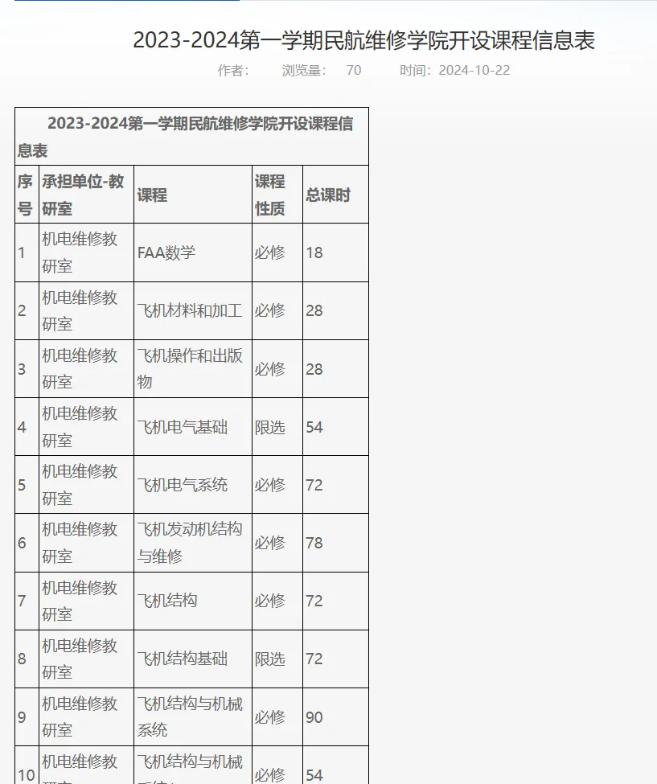       </p>
    </details>

### 民航维修执照考试教材及ATA教材
1. 最新修订的关于发布民用航空器维修基础（M1-M6）系列教材

    <details>
    <summary>执照教材</summary>
    <p align="center"> 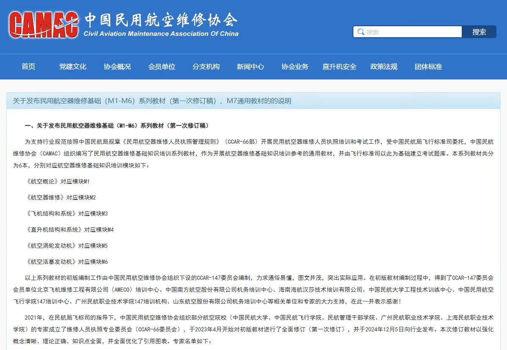       </p>
    </details>

2. ATA教材

    <details>
    <summary>ATA教材</summary>
    <p align="center"> 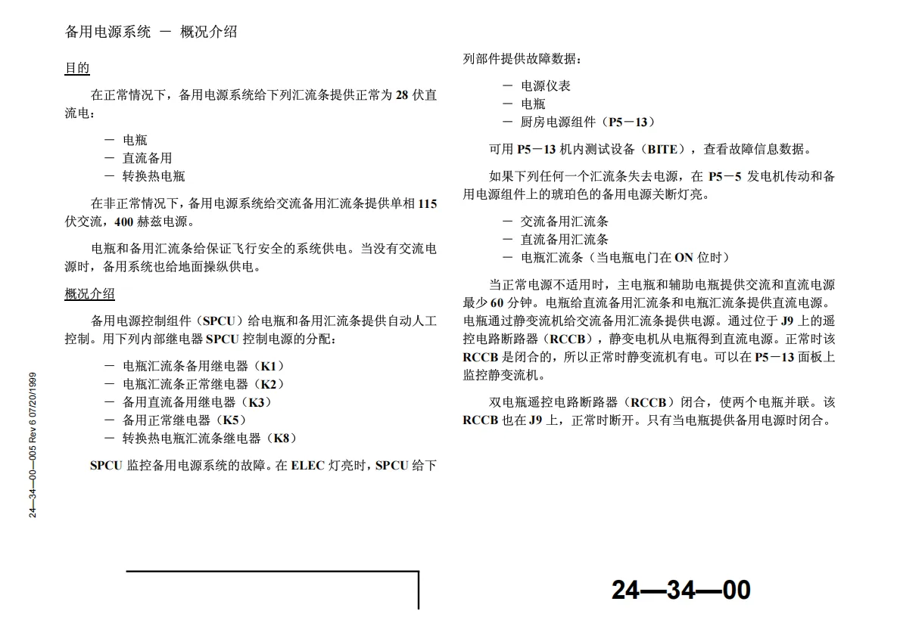       </p>
    </details>

### 相关论文、期刊、图书等
1. 知网、万方等相关主题检索，示例如下图：

    <details>
    <summary>论文</summary>
    <p align="center"> 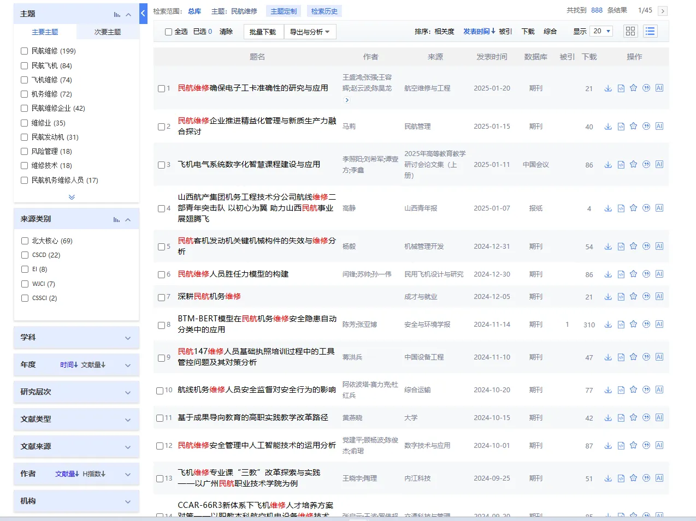       </p>
    </details>

2. 期刊，如《航空维修与工程》

    <details>
    <summary>期刊</summary>
    <p align="center"> 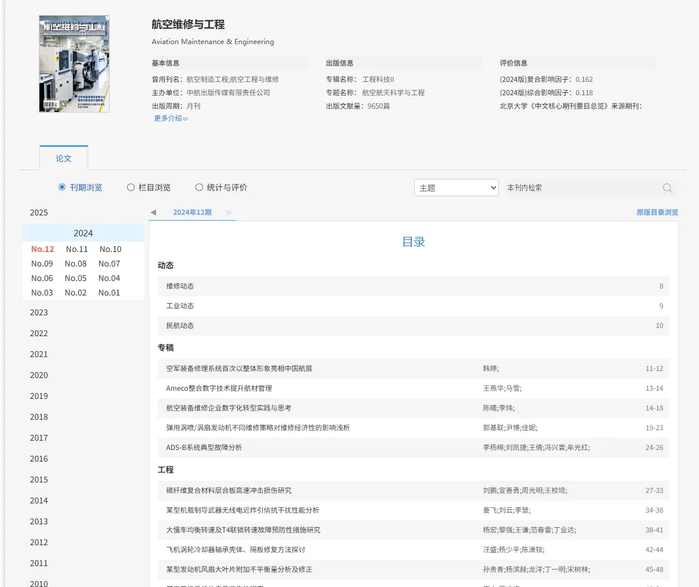       </p>
    </details>

3. 相关经典民航维修图书等，如《波音737NG飞机系统》、《民航机务英语教程》等

    <details>
    <summary>经典图书</summary>
    <p align="center"> 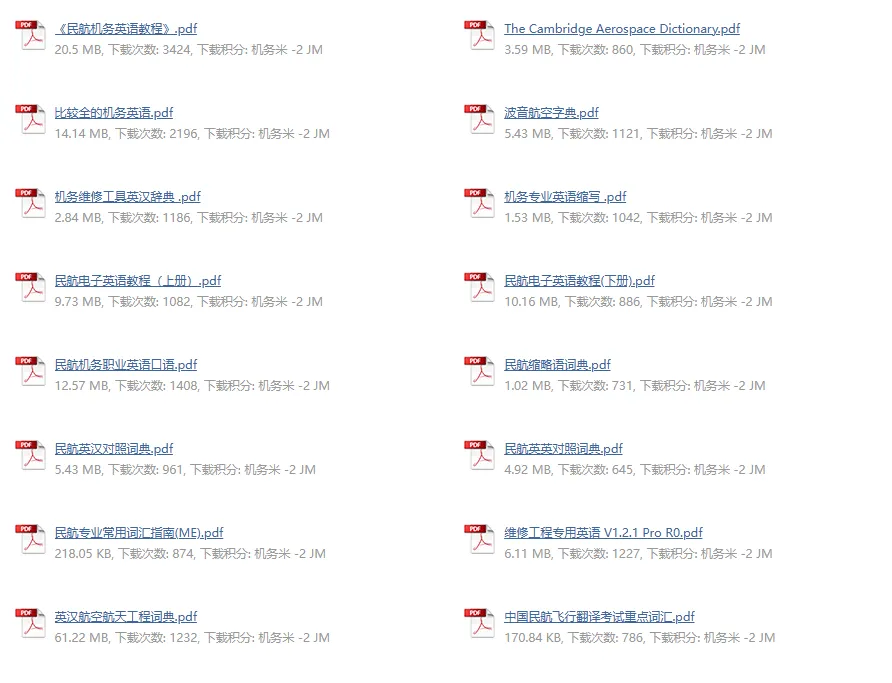       </p>
    </details>

### 官方维修手册及专业培训资料课件
1. 波音飞机 FIM 手册、空客飞机 TSM 手册、ATA 手册等

    <details>
    <summary>各类手册</summary>
    <p align="center"> 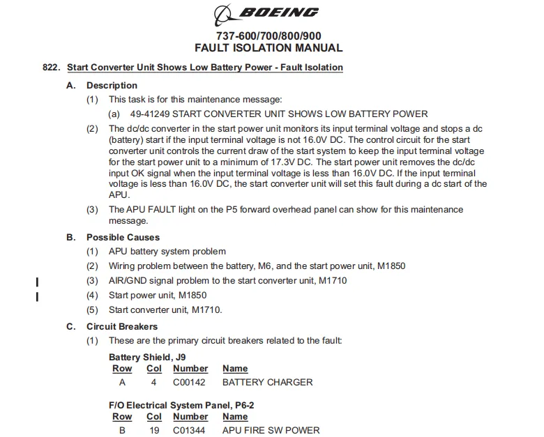       </p>
    </details>

2. 培训资料课件(PDF、Word、PPT等格式)

    <details>
    <summary>各类教辅讲义等</summary>
    <p align="center"> 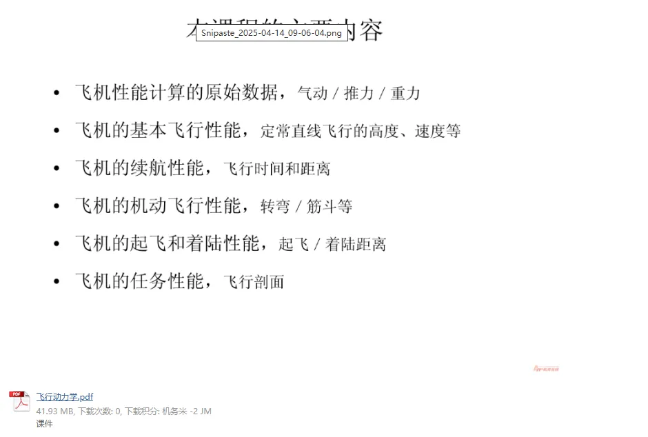       </p>
    </details>

### 网上开源数据
1. 相关优质的开源社区，如机务在线论坛

    <details>
    <summary>机务在线论坛</summary>
    <p align="center"> 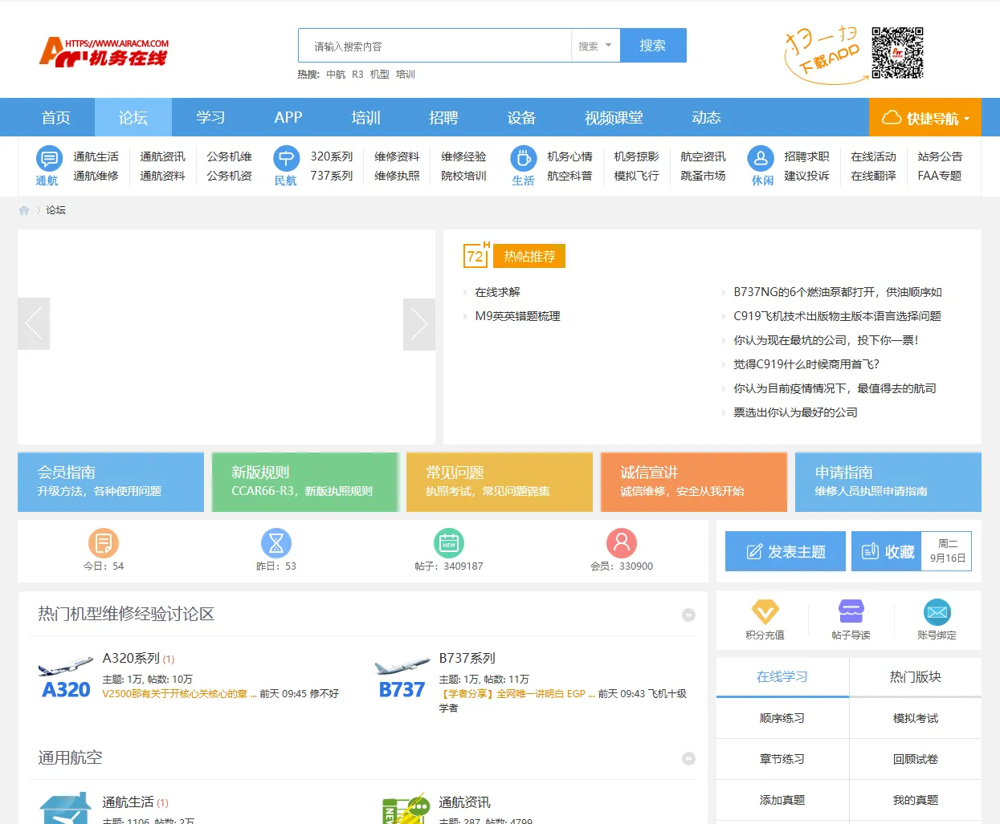       </p>
    </details>

2. 相关优质公众号文章等

    <details>
    <summary>开源高质量领域文章</summary>
    <p align="center"> 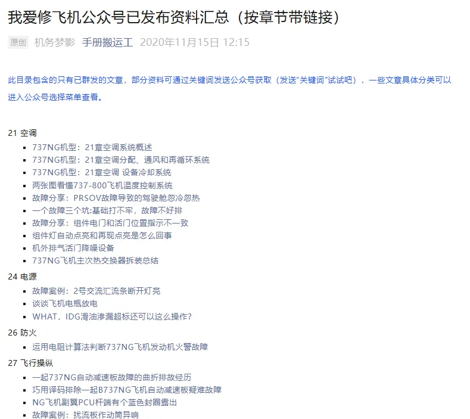       </p>
    </details>

### 合成数据
利用多模态大模型，针对含图量较高的数据进行文本合成，进一步挖掘利用图片、视频中的民航维修相关的知识。
1. 民航维修相关的实操视频，进行视频理解并文本生成

    <details>
    <summary>视频理解</summary>
    <p align="center"> 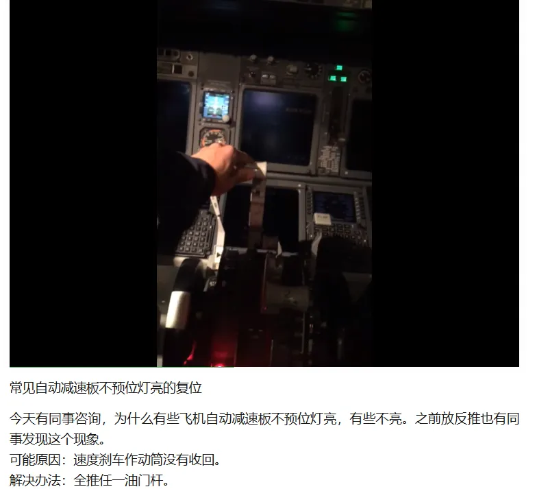       </p>
    </details>

2. 民航维修相关的原理图、结构图等，进行图片理解并文本生成

    <details>
    <summary>图片理解</summary>
    <p align="center"> 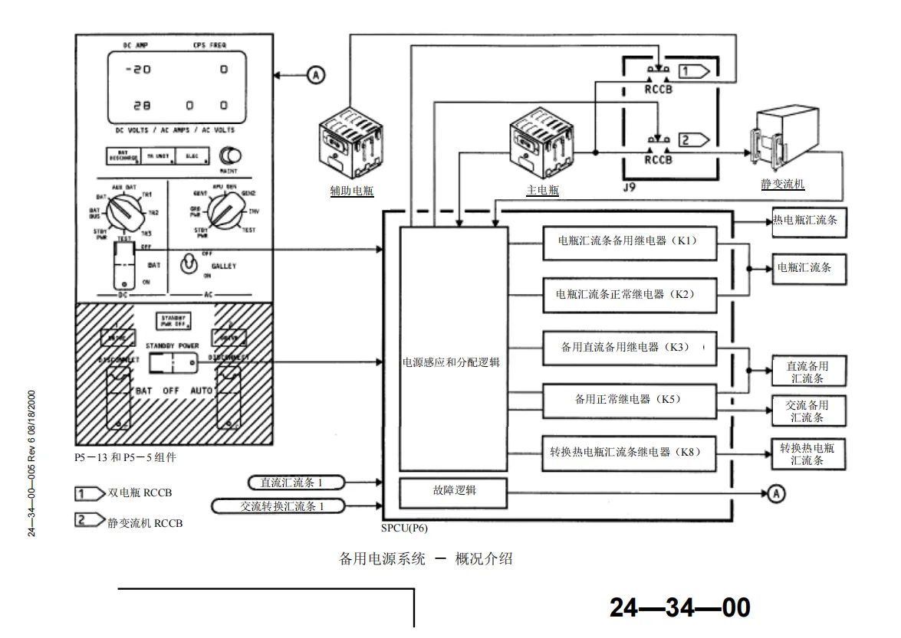       </p>
    </details>

## 预训练数据获取

### 多模态大模型
从多个维度、多个渠道收集到的民航维修相关数据格式多样繁杂。除了 PDF、PPT、Word、网页H5等文件格式外，版式更是复杂多变，这给 OCR 带来一定困难。然而最近一段时间，多模态大模型进展迅速。为了尽快拿到较高质量的 OCR 文本数据，采用 prompt 指令工程 + 多模态大模型的文本获取方法。
    <p align="center"> 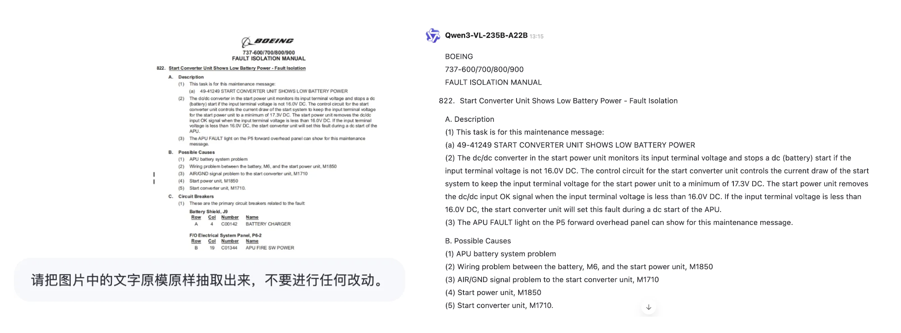       </p>

获取 OCR 文本的脚本：[get_ocr_text_by_lmm.py]("scripts/get_ocr_text_by_lmm.py")

## 预训练数据清洗

根据不同数据源以及相应的格式及版式，随机分层抽样，分别构建 500 左右的清洗策略的探索集和 200 左右的清洗策略的评估集。针对预训练数据的清洗策略，不断迭代地进行探索和评估。

### 问题暴露 & 指令 Prompt 调优
不断的根据多模态大模型解析出来的 OCR 的文本存在的问题，在 500 左右的探索集上优化 prompt 指令。

### 数据清洗及分块
经过 Prompt 调优后，我们对 OCR 文本进行数据分析，发现存在的问题并进行迭代清洗策略并优化，其中最重要的两个问题如下：

1. 目录部分会导致重复无意义的 pattern 出现，这对于 LLM 是严重威胁，导致复读机现象

2. 一些结合各种图表的表述，当缺失图标只看文本，会造成上下文不通顺或者歧义，需要处理。

经过清洗，得到高质、干净、知识密集的文本之后，需要考虑进一步分块。用 semchunk ，进行语义分块。

```
semchunk：通过递归拆分文本，直到所有生成的块大小等于或小于指定的块大小。具体来说，它执行以下操作：

1. 使用语义上最有意义的拆分器拆分文本；
2. 递归拆分生成的块，直到产生一组大小等于或小于指定块大小的块；
3. 将任何小于块大小的块重新合并，直到达到块大小；
4. 除非这样做会使块大小超过限制，否则将任何非空白拆分器重新附加到块的末尾（除最后一个块外），否则将非空白拆分器作为自己的块添加；
```

分块脚本：[split_part.py]("scripts/split_part.py")

## 预训练模型实验

### 探索性实验
#### 实验一：跑通预训练实验代码

* 数据集：
* 实验结果：

    1. 以 Qwen3-8B-Base 为代表，在 ms-swift 框架下跑通 Dense 模型的持续预训练，脚本：[dense_pt_with_swift.sh](scripts/dense_pt_with_swift.sh)

        <details>
        <summary>损失loss下降图</summary>
        <p align="center"> 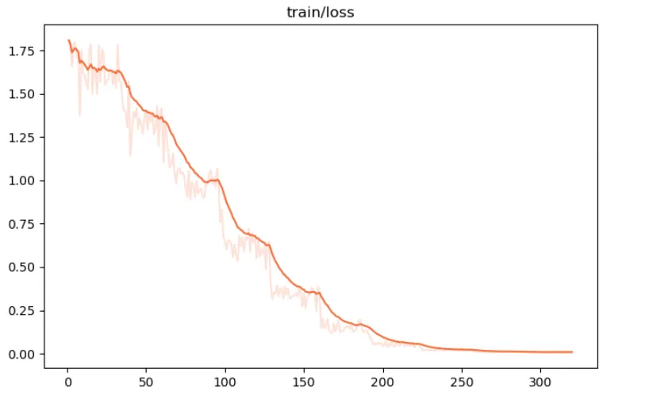</p>
        </details>

    2. 以 Qwen3-8B-Base 为代表，在 megatron 框架下跑通 Dense 模型的持续预训练，脚本：[dense_pt_with_megatron.sh](scripts/dense_pt_with_megatron.sh)

        <details>
        <summary>损失loss下降图</summary>
        <p align="center"> 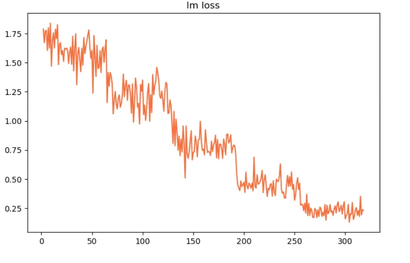</p>
        </details>

    3. 以 Qwen3-30B-A3B-Base 为代表，在 megatron 框架下跑通 MoE 模型的持续预训练，脚本：[moe_pt_with_megatron.sh](scripts/moe_pt_with_megatron.sh)

        <details>
        <summary>损失loss下降图</summary>
        <p align="center"> 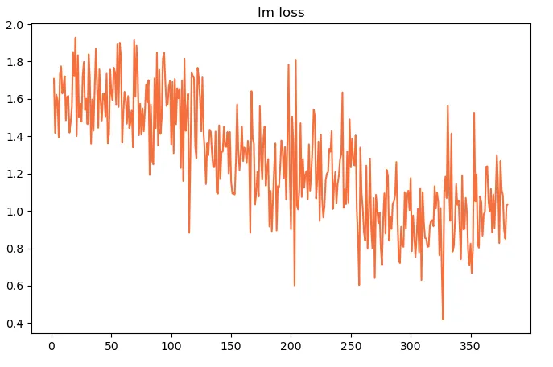</p>
        </details>

* 实验结论：
    1. 针对 megatron 训练，需要先将 huggerface 格式的模型转换为 megatron 格式，转换脚本：[hf_to_megatron.sh](scripts/hf_to_megatron.sh)
    2. 针对 MoE 模型的持续预训，现阶段 megatron 支持得更好。

## 持续预训练收益评估
在之前建设的 [CAMB](https://github.com/CamBenchmark/cambenchmark) 民航维修大模型基准上对持续预训练产出的模型进行收益评估。
